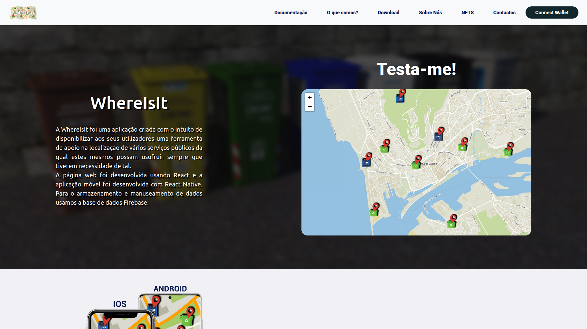
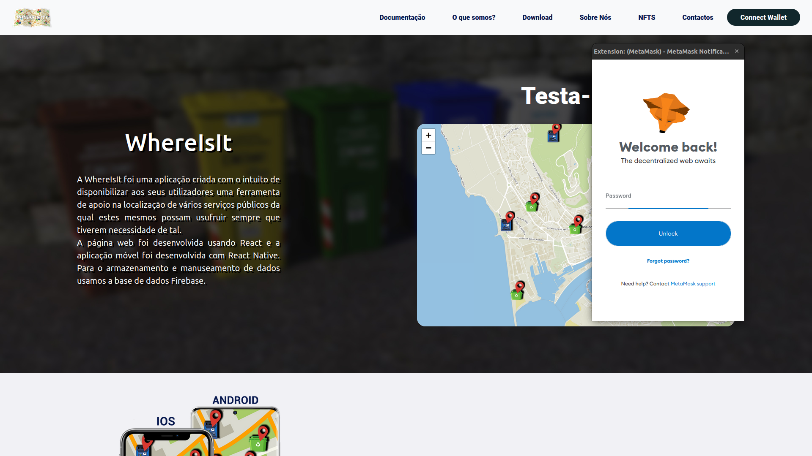
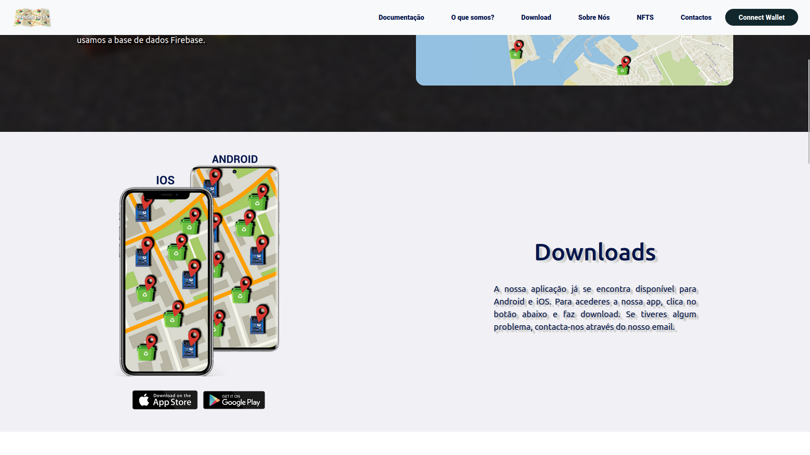

# Geotagging (Projeto de Sistemas de Informação)

No âmbito da unidade curricular de "Projeto de Sistemas de Informação" inserida no plano de
estudos do 2º de CTeSP de Tecnologias e Programação de Sistemas de Informação da Escola
Superior de Tecnologia e Gestão,  o grupo decidiu escolher como temática para a realização deste trabalho a
criação de uma plataforma de fornecimento de localizações de serviços públicos.
Este projeto, consiste em uma aplicação web e mobile, que permite encontrar pontos de referencia, numa determinada localização. Esta componente, é composta por 3 projetos, frontend, backend e a camada de serviços, neste caso, a API.

## Print screens do frontend

- Este é a pagina inicial, onde se destaca um mapa de exemplo.

 

- Uma das funcionalidades implementadas no website, era o login com uma carteira que funcina em cima da rede da etherium.

 

- Esta é a secção onde tinha alguns dados sobre a APP e para fazer download da mesma.

 

- Uma breve apresentação dos desenvolvedores da aplicação.

## Scripts

Para verificar a aplicação em funcionamento, é necesario utilizar o seguinte comando:

### `npm start`

Executa a aplicação no modo de desenvolvimento.
Abra [http://localhost:3000] (http://localhost:3000) para a visualizar no browser.

A página será recarregada se fizer edições.
Também verá quaisquer erros de lint na consola.
